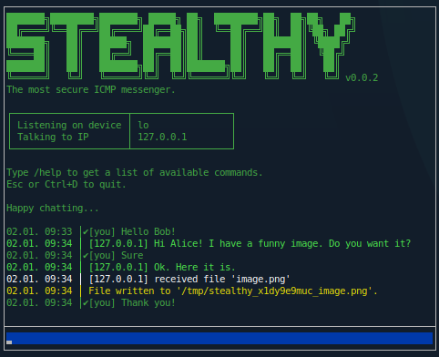
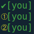

# Stealthy

Stealthy is a simple messenger application which runs in the terminal without any graphical UI. It uses ICMP echo requests to communicate with other clients - the same method used by the ping utility on Linux systems. As firewalls are usually configured to allow ICMP echo requests, stealthy can bypass many of them.



**Features**

* The communication is end-to-end encrypted. You can chose symmetric encryption or asymmetric encryption.
* The communication is hidden to some degree as communication is masked as ICMP requests.
* No server is involved. The clients communicate directly with each other. Hence, every client needs to be reachable via an IP address.
* Offers file upload functionality via ICMP requests.
* Group chat (currently for symmetric encryption only).

## Installing

### Requirements

Stealthy requires Rust >=1.31. You can install it via rustup:

    curl https://sh.rustup.rs -sSf | sh

On Ubuntu the following packages are required to compile the sources:

    sudo apt-get update
    sudo apt-get install build-essential libpcap-dev libssl-dev
    
### Compile
```bash
# checkout the sources
git clone https://github.com/daniel-e/stealthy.git
# build the sources
cd stealthy
cargo build --release
```

The binary `stealthy` can be found in the directory `./target/release/`.

### Capabilities
Stealthy needs raw sockets which are not allowed for non-privileged users. Hence, you have two options to execute the binary. First, you could run it as root which is not recommended from a security point of view. Second (which is recommended) you could give the binary the appropriate capabilities. As root do:

    setcap cap_net_raw+ep ./target/release/stealthy

Now, you can use stealthy as a non-privileged user.

### Test (optional)

Open two terminals and execute stealthy in each terminal without any arguments. The clients should be able to talk to each other.

### Compile time features (optional)
Steahlty calls `notify-send` to show notifications for new messages on the desktop. You can disable this feature at compile time:

    cargo build --features "no_notify"

Here is a list of all compile time features:

| Feature | Description |
|---------|-------------|
| no_notify       | Disable desktop notifications via notify-send. |
| show_dropped    | Show dropped packets which are not on the whitelist. |

## Running stealthy

Stealthy requires at least two command line arguments:
* `-i` specifies the network interface which is used to listen for incoming messages.
* `-d` specifies the IP address of the receiver. For a group chat you can provide several IPs each separated by a comma.


### Message status

Next to the messages that you have sent you can see a status symbol.



* A green check is shown when your message has been received by all clients.
* A yellow number shows how many ACKs are pending.

### Choosing between symmetric and asymmetric encryption

Further, stealthy can be used in two encryption modes: symmetric encryption and hybrid encryption.

**Symmetric encryption** is choosen with the command line argument `-e` followed by a 128 bit encryption key in hexadecimal (i.e. 32 characters in the range 0..9 and a..f). If -e is not given the default key `11111111111111111111111111111111` is used. **Use the default key with caution!** Although the messages are not transmitted in plaintext when the default key is used everyone who knows this key could decrypt your messages.

Examples to use stealthy with symmetric encryption:
```bash
# stealthy with default encryption key
sudo ./stealthy -i eth0 -d 1.2.3.4

# stealthy with a use defined encryption key
sudo ./stealthy -i eth0 -d 1.2.3.4 -e a1515134c543aafca4796a256839a6b2
```

*btw: you could use to following command to create good keys: `cat /dev/urandom | xxd -p -l 16`*

**Hybrid encryption**

There is one drawback that comes with the symmetric encryption mode. Both chat clients have to use the same key so you have to exchange the key with your chat partner before you can chat. Exchanging the key securely is often difficult or even not possible. Thus, stealthy also supports a hybrid encryption.

Hybrid encryption is actived with the command line arguments `-r` and `-p`. Both arguments are required to enable the hybrid encryption. With -r (r for receiver) you can specify the name of the file which contains the public key of the receiver. The public key is used for encrypting a message and only the client which is in possession of the corresponding private key can decrypt the message. With -p (p for private) you can specify the name of the file which contains your private key which is used to decrypt the messages that have been encrypted with your public key.

Here is an example: let's assume Alice and Bob want to communicate via stealthy. Alice creates a public key `pubA` and a private key `privA`. Bob creates a public key `pubB` and a private key `privB`. Alice sends her public key `pubA` to Bob and Bob sends his public key `pubB` to Alice. Now, to communicate Alice and Bob start stealthy as follows:

```bash
# Alice
sudo ./stealthy -i eth0 -d 1.2.3.4 -r pubB -p privA
# Bob
sudo ./stealthy -i eth0 -d 2.4.1.2 -r pubA -p privB
```

To generate a key pair you can use the following command:

```bash
# create a 2048 bit private key
openssl genrsa 2048 > rsa_priv.pem
# compute the public key from the private key
openssl rsa -in rsa_priv.pem -pubout > rsa_pub.pem
```


## Limitations

* Stealthy currently works only on systems with a little-endian architecture, like Intel processors.

* Both communication partners must not sit behind a NAT because each of them must know the IP address of the other.

